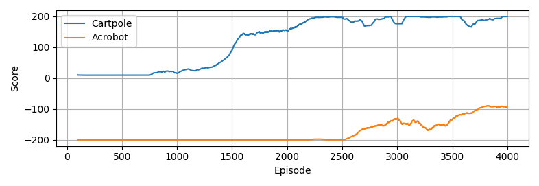
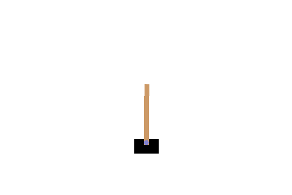

# Multi-Task Reinforcement Learning
Multi-task reinforcement learning using CLEAR algorithm from \[[1](https://arxiv.org/abs/1811.11682)\]. Actor-critic reinforcement learning used to learn 2 tasks in a single policy without demarcating tasks when learning. Off-policy learning and behavioural cloning from experience replay was introduced to prevent catastrophic forgetting.

Dependecies include gym, numpy, matplotlib and imageio. Reinforcement learning agent and machine learning classes written entirely in numpy for learning purposes.

Other useful papers include \[[2](https://arxiv.org/abs/1611.01224)\] and \[[3](https://arxiv.org/abs/1802.01561)\]. The reinforcement learning algorithm closely follows that described in \[2\].

## File descriptors
* <code>copy_cartpole_custom.py</code>
  * Copy custom cartpole class (which has 3 discrete action space instead of 2) to installed gym location.
* <code>train_single_task.py</code>
  * Trains an agent on single cartpole task.
* <code>postprocess_single_task.py</code>
  * Post process results from trained agent to obtain gif.
* <code>train_multi_task.py</code>
  * Trains an agent on both cartpole and acrobot case.
* <code>postprocess_multi_task.py</code>
  * Post process results from trained agent to obtain gif.

First run <code>copy_cartpole_custom.py</code>, followed by either of the training script and the respective post process script. Single task takes about 15 minutes to train while multi task takes couple of hours. The code was written for transparency, not speed.

## Results

 

## References
\[1\] D. Rolnick et al., "Experience Replay for Continual Learning", in NeurIPS, 2019.

\[2\] Z. Wang et al., "Sample Efficient Actor-Critic with Experience Replay", in ICLR, 2017.

\[3\] L. Espeholt et al., "IMPALA: Scalable Distributed Deep-RL with Importance Weighted Actor-Learner Architectures", in ICML, 2018.